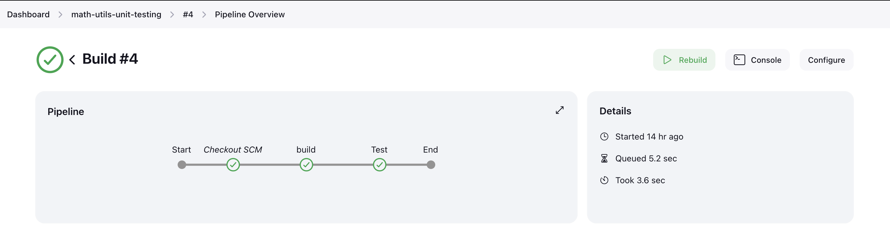

## Installed software

   


## PROBLEM STATEMENT
The objective of the repository is to implement basic math utility functions in Python , accompanied by test cases that can be tested using pytest . Additionally, Jenkins  integration will be set up for automated testing. 

## Python
[MathUtils.py](/MathUtils.py) contains basic mathematical functions such as addition, subtraction, multiplication and division.
[tests_data.py](/tests_data.py) stores test cases for different functions.

## Pytest
[test_math_utils.py](/test_math_utils.py) contains test cases for those mathematical operations with setup and teardown methods.

## Jenkins Pipeline
- Downloaded **jenkins-lts** using ```brew install jenkins-lts``` and setting up configuration details for the admin.
- Created a pipeline in jenkins which polls this github repository using webhook and sends an email notification to the receipient with build logs.
- Intialized two stages: **build** to compile python files and **test** to run test cases and generates an xml report inside the workspace.
- Pipeline script can be found in this [Jenkinsfile](/Jenkinsfile)
- Tunneled localhost with Ngrok to create a proxy address for using a webhook in GitHub and to automate the pipeline when new commits happen.

### Pipeline Overview



### Build Log

<pre style="max-height:200px; overflow:auto" max-height="10px">Started by GitHub push by VigneshPugalenthi
Obtained Jenkinsfile from git https://github.com/VigneshPugalenthi/unit-testing-with-jenkins.git
[Pipeline] Start of Pipeline
[Pipeline] node
Running on Jenkins in /Users/vigneshpugalenthi/.jenkins/workspace/math-utils-unit-testing
[Pipeline] {
[Pipeline] stage
[Pipeline] { (Declarative: Checkout SCM)
[Pipeline] checkout
Selected Git installation does not exist. Using Default
The recommended git tool is: NONE
No credentials specified
 > git rev-parse --resolve-git-dir /Users/vigneshpugalenthi/.jenkins/workspace/math-utils-unit-testing/.git # timeout=10
Fetching changes from the remote Git repository
 > git config remote.origin.url https://github.com/VigneshPugalenthi/unit-testing-with-jenkins.git # timeout=10
Fetching upstream changes from https://github.com/VigneshPugalenthi/unit-testing-with-jenkins.git
 > git --version # timeout=10
 > git --version # 'git version 2.39.3 (Apple Git-145)'
 > git fetch --tags --force --progress -- https://github.com/VigneshPugalenthi/unit-testing-with-jenkins.git +refs/heads/*:refs/remotes/origin/* # timeout=10
 > git rev-parse refs/remotes/origin/main^{commit} # timeout=10
Checking out Revision 82bd4b4707ba0cd8b7121debc057b661b402314a (refs/remotes/origin/main)
 > git config core.sparsecheckout # timeout=10
 > git checkout -f 82bd4b4707ba0cd8b7121debc057b661b402314a # timeout=10
Commit message: "Added assets folder"
 > git rev-list --no-walk 8d358919c2cf6d6c0fcd3223d2202f3caa85dd76 # timeout=10
[Pipeline] }
[Pipeline] // stage
[Pipeline] withEnv
[Pipeline] {
[Pipeline] stage
[Pipeline] { (build)
[Pipeline] sh
+ python3 -m py_compile MathUtils.py tests_data.py
[Pipeline] }
[Pipeline] // stage
[Pipeline] stage
[Pipeline] { (Test)
[Pipeline] sh
+ python3 -m pytest --junit-xml test-reports/results.xml test_math_utils.py
============================= test session starts ==============================
platform darwin -- Python 3.11.2, pytest-8.0.0, pluggy-1.4.0
rootdir: /Users/vigneshpugalenthi/.jenkins/workspace/math-utils-unit-testing
collected 16 items

test_math_utils.py ................                                      [100%]

- generated xml file: /Users/vigneshpugalenthi/.jenkins/workspace/math-utils-unit-testing/test-reports/results.xml -
============================== 16 passed in 0.02s ==============================
Post stage
[Pipeline] junit
Recording test results
[Checks API] No suitable checks publisher found.
[Pipeline] emailext
Sending email to: vignesh1998.vk@gmail.com
</pre>

